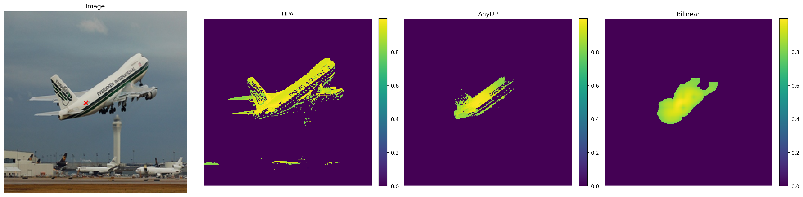
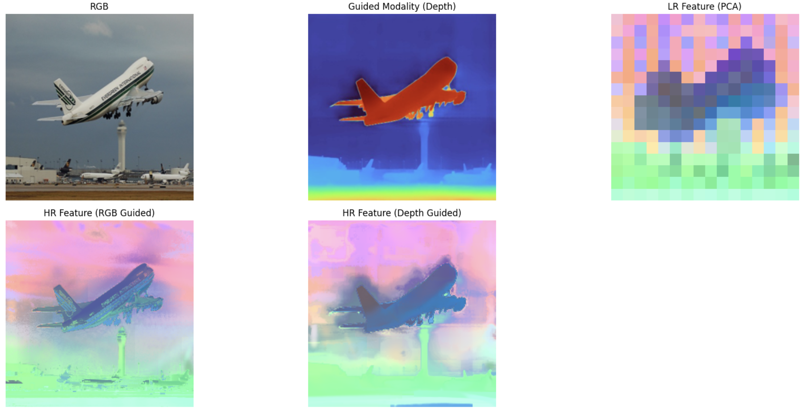
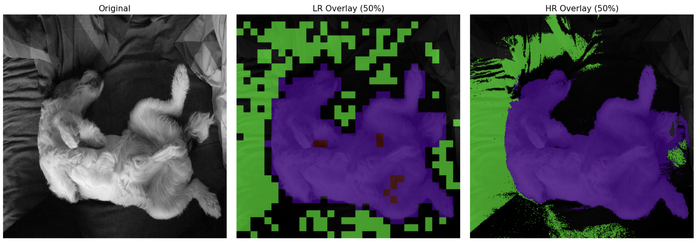

🆕 **[2025-12-01]** : Initial Application code release 

🆕 **[2025-11-24]** : Initial code release (Given the high number of requests, we have decided to release the code in its current state before further cleanup.)

:warning: The current version is slightly slower than the one reported in the paper, because the speed-optimized code has not yet been fully integrated due to compatibility issues across different versions.

# Upsample Anything 

**KAIST, MIT, Microsoft**

Minseok Seo, Mark Hamilton, Changick Kim

[ :scroll: [`Paper`](https://arxiv.org/html/2511.16301v1)] [ :globe_with_meridians: [`Website`](https://seominseok0429.github.io/Upsample-Anything/)] [ :book: [`BibTeX`](#-)]

## Overview

<div align="center">
  

  <i>Our method performs lightweight test-time optimization (≈0.419 s/image) without requiring any dataset-level training.It generalizes seamlessly across domains while maintaining consistent reconstruction quality for every image. (All examples are randomly selected, without cherry-picking.)</i>
</div>


### Simple usage, similar to OpenCV’s `cv2.resize`

```python

img_path = "../img/sample.png"
img = Image.open(img_path).convert("RGB").resize((224, 224), Image.BICUBIC) # <- Any Target Size
lr_feature = dinov2_infer(img) # <- any low resolution modalities (e.g. depth, Probability map, feature map)
hr_feature = UPA(img, lr_feature) 
```

### Point Similarity Experiments (See cookbooks/Similarity.ipynb)

<div align="center"> 

<i>Our method not only upsamples features but also denoises them and reinforces coherent object-level grouping.</i>

</div>

### Supports Not Only RGB Guidance but Any Modality (See cookbooks/Modality.ipynb)

<div align="center"> 

<i>Our method can operate not only with RGB guidance but with *any* modality (with only minimal code changes). The depth sample below was generated using **[Depth Pro](https://github.com/apple/ml-depth-pro)**.
</i>

</div>

### Supports Not Only Feature Map Upsampling, but Any Modality Upsampling  (See cookbooks/prob_upsample.ipynb)

<div align="center">
  

  <i>
    Our method is not limited to feature-map upsampling&mdash;it can also upsample 
    probability maps, depth maps, and other modalities.
  </i>
</div>

### Acknowledgement

We sincerely thank [Young-Tack Oh](https://scholar.google.com/citations?user=fkjUawMAAAAJ&hl=ko) for checking the typos and revising figures in our paper, and we also thank [Young-Jae Park](https://scholar.google.com/citations?user=eaT9X2MAAAAJ&hl=ko) for revising our figures.

## Citing Upsample Anything

If you find this repository useful, please consider giving a star :star: and citation :Upsample Anything::

```
@misc{seo2025upsampleanythingsimplehard,
      title={Upsample Anything: A Simple and Hard to Beat Baseline for Feature Upsampling}, 
      author={Minseok Seo and Mark Hamilton and Changick Kim},
      year={2025},
      eprint={2511.16301},
      archivePrefix={arXiv},
      primaryClass={cs.CV},
      url={https://arxiv.org/abs/2511.16301}, 
}
```
